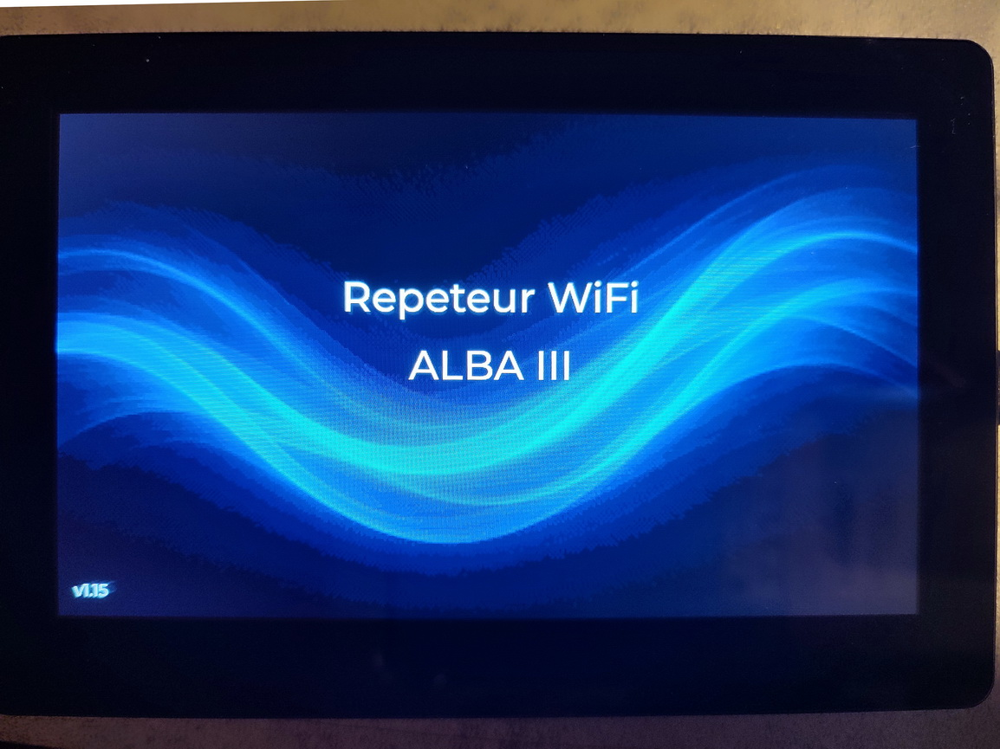
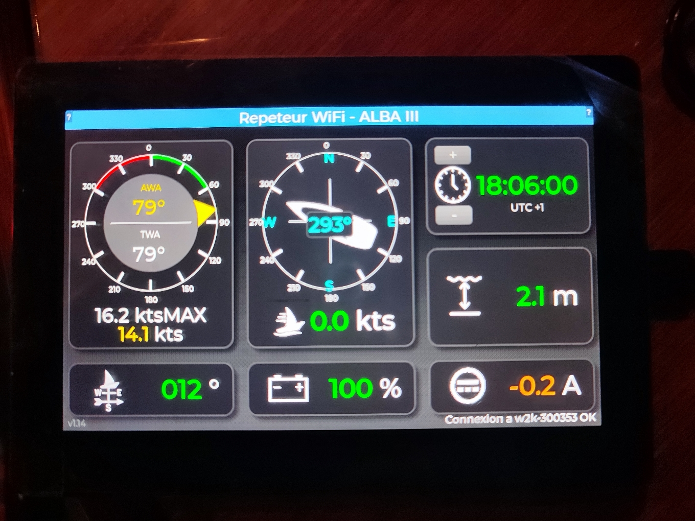
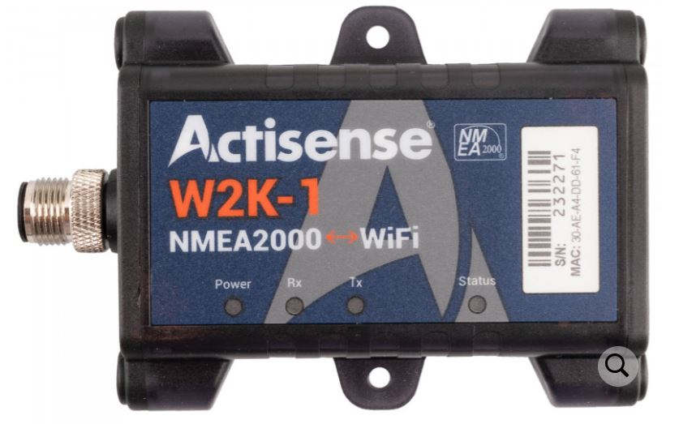

Ce projet est la programmation d’une carte Waveshare ESP32 S3 Touch LCD 5B ( https://www.waveshare.com/esp32-s3-touch-lcd-5.htm )pour l’utiliser comme petit écran répéteur à installer dans une des cabines de notre voilier.

L’idée est d’avoir en un clin d’œil une vue sur les paramètres essentiels lors de la navigation ou au mouillage sans avoir à quitter la cabine pour lire les autres instruments.

Les données sont récupérées du réseau NMEA2000 par un répéteur Wifi Actisense W2K-1. La carte Waveshare capte l’émission Wifi de ce répéteur et les affiche sur un écran unique. Ainsi la carte n’est pas directement reliée au réseau en ne nécessite donc qu’un câblage simple : une alimentation 12V du bord.

Le W2K-1 est paramétré pour créer un serveur Wifi en UDP émettant les données au format ASCII N2K. Ce format, bien que propriétaire Actisense, a été préféré au classique NMEA0183 qui, sur cet appareil, ne fournit pas de sentence contenant le SOC Batterie et le courant de batterie.

Le tactile de la carte Waveshare est utilisé pour :
-	Passer en mode veille afin de diminuer la luminosité de l’écran en touchant le centre de l’écran. Il ne s'agit pas d'un réel mode veille ni d'un ajustement de la luminosité que je n'ai pas trouvé sur cette carte. Il s'ajit juse d'un overlay opaque à 90%.
-	Remettre à zéro le vent apparent maximum en touchant la zone « xx.x kts MAX »
-	Modifier le décalage horaire. La valeur est mémorisée dans la NVS de l'ESP32 5 secondes après la dernière pression de touche et pas immédiatement après chaque pression de touche. Cela permet de ne pas user prématurément la NVS en diminuant les cycles d'écriture.
  
La programmation a été faite avec l’IDE Arduino v2.3.6 en C++ et LVGL en vibe coding avec l’assistance d’Antorpic Claude Sonnet 4.5 Pro.
L’écran de splash et les icones ont été générés par Microsoft Copilot.

